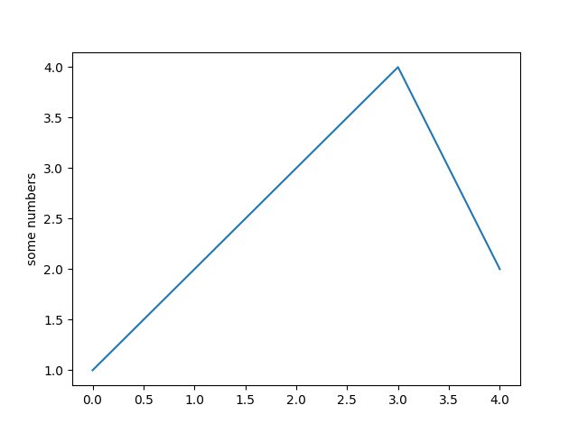

Playing with pyplot and Jupyter
-------------------------------

Nothing really useful here

References
----------

Pyplot

- `Pyplot tutorial <https://matplotlib.org/tutorials/introductory/pyplot.html>`_
- `Python Plotting With Matplotlib (Guide) <https://realpython.com/python-matplotlib-guide/>`_

Jupyter

- `Using matplotlib in jupyter notebooks — comparing methods and some tips <https://medium.com/@1522933668924/using-matplotlib-in-jupyter-notebooks-comparing-methods-and-some-tips-python-c38e85b40ba1>`_

- `​​​​Jupyter Notebook for Beginners: A Tutorial <https://www.dataquest.io/blog/jupyter-notebook-tutorial/>`_

Numpy

- `Numpy Guide for People In a Hurry <https://towardsdatascience.com/numpy-guide-for-people-in-a-hurry-22232699259f>`_

- `Python Numpy Tutorial (with Jupyter and Colab) <https://cs231n.github.io/python-numpy-tutorial/>`_
- `Python Numpy Array Tutorial <https://www.datacamp.com/community/tutorials/python-numpy-tutorial>`_

Pandas

- `NumPy and Pandas difference: Tutorial – Data Analysis with Python <https://cloudxlab.com/blog/numpy-pandas-introduction>`_
- `The Pandas DataFrame: Make Working With Data Delightful <https://realpython.com/preview/pandas-dataframe/>`_
- `Learning pandas by Exploring COVID-19 Data <https://www.fullstackpython.com/blog/learn-pandas-basic-commands-explore-covid-19-data.html>`_
- `How can we download fundamentals data with Python? <http://theautomatic.net/2020/05/05/how-to-download-fundamentals-data-with-python/>`_

Others

- `How a Data Scientist buys a car <https://towardsdatascience.com/how-a-data-scientist-buys-a-car-822fffbe384d>`_

Data sources

- `Open Data di Arpae "Dati Arpae Emilia Romagna <https://arpae.datamb.it/>`_
- `Qualità dell'Aria - Dati di monitoraggio - Catalogo dei dati storici e ultime rilevazioni in Web Service NRT (Near Real Time) sulla qualità dell'aria raccolti ed elaborati dalla rete di monitoraggio della regione Emilia-Romagna" <https://dati.arpae.it/dataset/qualita-dell-aria-rete-di-monitoraggio>`_

